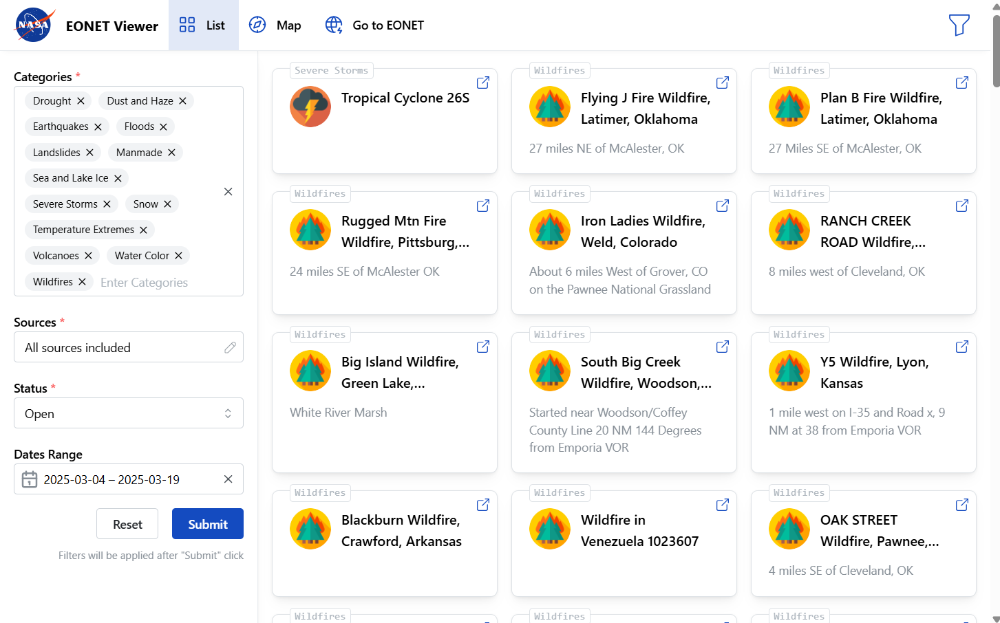

# EONET Events Viewer

This is a demo project based on [EONET API](https://eonet.gsfc.nasa.gov/docs/v3) data to play with features of .NET, React, etc.

## How to run

⬇️ Check out the repo locally on Windows.

🚀 Run [start.cmd](/start.cmd) to start both back end and front end.

🦄 It has the same effect as running [EonetViewer](backend\EonetViewer\EonetViewer.sln) .NET solution from Visual Studio.

⚠️ On the first run, restoring of **NuGet** and **npm** packages could take a few minutes.

🔗 A home page opens in browser automatically once things are ready.

## Quick Code Overview

- Back end implemented with .NET/C#:
  - [Eonet](./backend/EonetViewer/Eonet/IEonetClient.cs) - client for reaching EONET API, auto-generated from interface with **Refit** [🔗](https://github.com/reactiveui/refit)
    - [Eonet.IntegrationTests](./backend/EonetViewer/Tests/Eonet.IntegrationTests/EonetClientIntegrationTests_GetEvents.cs) - testing integration with the real 3rd-party API
    - [Eonet.Tests](./backend/EonetViewer/Tests/Eonet.Tests/EonetClientTests.cs) - units tests
  - [EonetViewer.Api](./backend/EonetViewer/EonetViewer.Api/Program.cs) - ASP.NET app, serves **gRPC Web** [🔗](https://learn.microsoft.com/en-us/aspnet/core/grpc/)[🔗](https://learn.microsoft.com/en-us/aspnet/core/grpc/grpcweb) to the browser client
    - 👌 _Regular JSON API would make more sense here, but I used gRPC Web for fun._
    - [events_service.proto](./backend/EonetViewer/EonetViewer.Api/Protos/events_service.proto), [EventsService.cs](./backend/EonetViewer/EonetViewer.Api/Services/EventsService.cs) - proto file and service implementation
- A _draft_ of SQL database (it can be deployed, but it's not in use yet):
  - [EonetViewer.Database](./backend/EonetViewer/EonetViewer.Database/eonet/Tables) - **MS SQL Server** Database project [🔗](https://learn.microsoft.com/en-us/sql/tools/sql-database-projects/sql-database-projects)
  - How the database is gonna be used?
    - To cache EONET data for performace
    - To attribute events to countries, etc. for advanced search experience.
- Front end implemented with **TypeScript** and **React**:
  - **Vite** [🔗](https://vite.dev/guide/) - used for initializing a React + TypeScript project and bundling
  - **ESLint** + **Prettier** configured
  - **PostCSS** with **CSS Modules** for styles
    - [EventsPage.module.css](./frontend/eonet-viewer-client/src/pages/EventsPage.module.css) - one of the .module.css implemented with it
  - **Mantine** [🔗](https://mantine.dev/overview/) - React components library, used for compoents and related hook
    - [EventsFilters.tsx](./frontend/eonet-viewer-client/src/components/EventsFilters/EventsFilters.tsx), [EventsFilters.core.tsx](./frontend/eonet-viewer-client/src/components/EventsFilters/EventsFilters.core.tsx) - a form implemented with it
  - **zustand** [🔗](https://zustand.docs.pmnd.rs/getting-started/introduction) - used for state management (Redux would be an overkill here)
    - [useEventsContext.ts](./frontend/eonet-viewer-client/src/state/useEventsContext.ts) - a store implemented with it
  - **Connect RPC** [🔗](https://connectrpc.com/docs/web/getting-started/) - used for gRPC Web browser client
    - [events_service_pb.ts](./frontend/eonet-viewer-client/src/clients/grpc-generated/events_service_pb.ts) + [EventsClient.ts (usage)](./frontend/eonet-viewer-client/src/clients/EventsClient.ts#L16) - auto-generated gRPC client and its' usage
  - **TanStack Query** [🔗](https://tanstack.com/query/latest/docs/framework/react/overview) - use for React client providing hooks
    - [EventsClient.ts](./frontend/eonet-viewer-client/src/clients/EventsClient.ts) - hooks implemented with it

## Screenshots

## Next tasks

- [ ] Filtering

  - [ ] Magnitude filtering

    - magnitude unit (magnitude range should be loaded based on other current filters)
    - range picker

  - [ ] Map view bounding box filtering

    - on Map view, filter based on bounding box on zoom-in/zoom-out

  - [ ] Countries filtering

    - load Countries metadata from 3-rd party service
    - use 3rd-party service to attribute coordinates to Country
    - add filtering by countries on UI

- [ ] Align documentation between Eonet and events_service.proto
- [ ] Add maps on FE, display pins based on event coordinates
  - Choose maps to integrate with (Google Maps r smth else)
- [ ] Map geometry coordinates to countries (BE or FE?) and enables filtering by country on FE
- [ ] Add logging on backened
- [ ] Cover non-happy-path scenarious with unit tests on back end
- [ ] Return GrcException from EventsService on BE and connect it to notificatoins on FE
- [ ] Cache all events into local SQL db
  - Setup process of caching all events on applicaiton start as background service
- [ ] Add textbox search functionality on FE leveraging speed of local cache

## Done tasks

- ✅ 2025-03-20 Introduce front-end state management (`zustand`)
- ✅ 2025-03-19 Filtering. Basic Filtering
  - 'Categories' multi dropdown (all included by default) + reset button
  - 'Source' modal table multi select (all included by default) + reset button
  - 'Status' dropdown (Open by default)
  - 'Dates' date picker (last 10 days by default)
- ✅ 2025-03-11 Define SQL DB schema
- ✅ 2025-03-08 Load context to FE
- ✅ 2025-02-28 Serve gRPC Web from ASP.NET server, display on front end
- ✅ 2025-02-26 .NET EONET client
